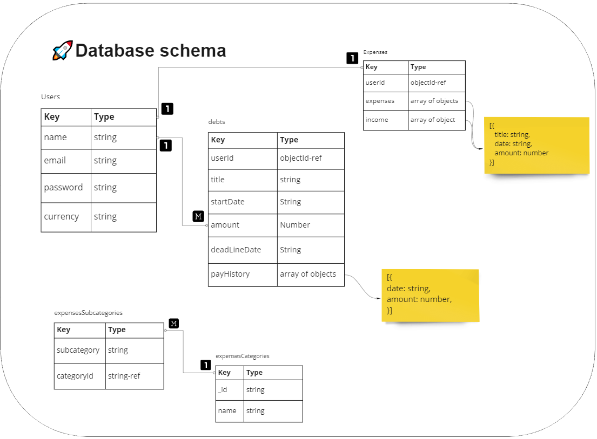

# Pro_Expenses_Tracker

<p align="center">
    
  </p>
Pro expenses tracker is a MERN stack and responsive application that requires the user to sign in to save all expenses to reach from anywhere. Users can track and filter expenses and income. Users can also manage debts and loans that need to be paid.

## Watch Demo

You can [click here](https://pro-expenses-tracker.herokuapp.com/) to watch the Demo which is deployed to Heroku website

## Use locally

> Note: it's better to follow these steps in order

- make a `fork` for this Repo and `clone` it in your PC.
- Copy and rename the `.env.example` file which is in `client` and `server` folders to be `.env` and put the right value in the variables.
- In Cli use this commands all in the `root` directory path in order

First you need to run this command to install some packages we need to run the app in the main directory

```
npm i
```

This command goes into the `Server` folder and installs the packages then does the same in `Client` folder

```
npm run setup
```

This command to run the application locally

```
npm run dev
```

## Technologies and npm used

- ## Database

  - Mongodb
  - Mongoose npm - to manage the schemas and data before going to the database
  - bcrypt npm - to hash the passwords and secure it
  - currency-symbol-map npm - to turn the currency name to the currency symbol
  <p align="center">
    
  </p>

- ## Use env files

  - dotenv npm - to access env files for to secure important variables and keys

- ## Frontend
  - React and React-router-dom to be able to navigate between several pages
  - Sass to style with some functions and variables

## MIT LICENSE

[MIT license](https://github.com/ObadaElSharbatly/Pro_Expenses_Tracker/blob/main/LICENSE)
